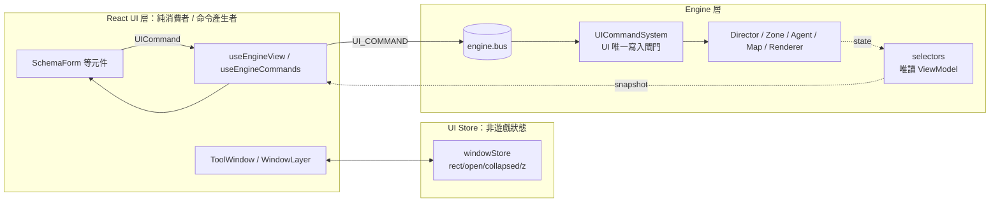

# UI 視窗系統 + UI 層 ECS/SSOT 解耦計畫 v2

> 對象：低階代理 / 後續執行者。
> 參考專案（唯讀）：`C:\Git\slot-llm-project\prototype\cascade-testbed-v4\`
> 　`js/core/tool-window.js`、`js/editors/window-chrome.js`、`js/editors/tool-menu.js`、`css/tools.css`、`css/tokens.css`
> 治理規則：`AGENTS.md`（≤3 檔/任務、無 `as any`、無寫死顏色/魔術數字、不加 `console.log`、完成後 `npm run lint` + `npm test` + `npm run build`）。
> 前置文件：[DECOUPLING_HANDOFF.md](./DECOUPLING_HANDOFF.md)（引擎層解耦，已完成 Round 1–2）。

---

## 0. 已確認的決策（使用者 2026-10-10 回覆）

| # | 決策 |
| :-- | :-- |
| D1 | Logs / SkillDB / VFXMap / Inspector / Monitor / Director 設定 / Zone 設定 / ShowcaseSettings 皆為**自由視窗**；MapEditor / Playback 為**釘選工具列**（可拖、記位置、不可縮放）。 |
| D2 | 視覺維持**玻璃擬態**（`liquid-*`），不改扁平風。顏色抽 token，外觀不重做。 |
| D3 | **觸控 / 行動裝置為正式支援目標** → U12 升為必做，且觸控把手/命中區在設計階段就納入（不是事後補）。 |
| D4 | **移除 Tailwind CDN**（改建置期安裝），**並且本次一併把 UI 層做成正規 ECS + SSOT 解耦**（UI 不得直接寫引擎狀態；設定欄位 / 視窗定義 / 主題皆資料驅動）。 |
| D5 | Inspector 切換選取單位時**沿用同一視窗位置**（rect 以視窗 id 記憶，與單位無關）。 |

---

## 1. 重大新發現（務必先讀）

> [!WARNING]
> **`index.css` 的 `@tailwind` / `@apply` 目前根本沒有被處理。** 專案走 Tailwind Play CDN（只處理 `<style type="text/tailwindcss">`），而 `index.css` 是 `<link>` 進來的普通 CSS。已實測 `dist/assets/index-*.css` 內仍留有原始 `@apply bg-slate-900/60 …`。
> 結果：`.liquid-card / .liquid-btn / .liquid-input / .liquid-tag / body{@apply…}` **現在沒有任何樣式**，目前看到的玻璃感全來自元件 className 內的 utility。（非 `@apply` 的 `@keyframes` 與 `@layer utilities` 內純 CSS 因原生支援而有效。）
> 因此 **U0（安裝 Tailwind 建置）會讓 `liquid-*` 第一次真正生效，畫面會有變化**（卡片出現 blur / ring / 圓角 / 陰影）。這符合 D2 的設計意圖，但必須**逐面板目視比對並回報給使用者**，不可靜默通過。

> [!NOTE]
> `index.html` 的 `importmap`（esm.sh React）在 Vite 建置下無作用（React 已在 `package.json`，由 Vite 打包），U0b 一併移除。Tailwind 選 **v3.4**（CDN 即 v3），維持 `@tailwind/@apply/shadow-[…]` 語意；**不用 v4**（工具名稱與預設值有差異，會造成額外視覺變動）。

### 1.1 UI→引擎耦合盤點（已掃描 `components/`、`hooks/`）

| 檔案 | 違規 |
| :-- | :-- |
| [SystemMenu.tsx](file:///c:/Git/Group-Battler-FFT-Final/components/ui/SystemMenu.tsx) | 直接寫 `engine.renderer.camera.followStiffness/zoomStiffness`、`engine.director.enabled`、`engine.zoneConfig[key]`；14 處 engine 存取 |
| [ShowcaseSettings.tsx](file:///c:/Git/Group-Battler-FFT-Final/components/ui/showcase/ShowcaseSettings.tsx) | **與 SystemMenu 內容重複**（Camera/Director/Zone 三組控制各寫一份）；同樣直接寫引擎；slider `min/max/step` 寫死在 JSX；20 處 engine 存取 |
| [UnitInspectorHUD.tsx](file:///c:/Git/Group-Battler-FFT-Final/components/ui/UnitInspectorHUD.tsx) | 直接 `agent.role = …`、`agent.maxHp/hp/maxMp = …` |
| [BehaviorTreeTab.tsx](file:///c:/Git/Group-Battler-FFT-Final/components/inspector/tabs/BehaviorTreeTab.tsx) | `agent.bt = engine.ai.buildAI(agent, engine)`（UI 直接呼叫 AI 系統並寫回） |
| [useGameInput.ts](file:///c:/Git/Group-Battler-FFT-Final/hooks/useGameInput.ts) | 33 處：`engine.map.setObstacle/removeObstacle`、`engine.addAgent/removeAgent/updateAgentPosition`、`agent.role = …; agent.saveState()` |
| [useGameApp.ts](file:///c:/Git/Group-Battler-FFT-Final/hooks/useGameApp.ts) | 56 處 engine 存取；同時混雜「遊戲流程」與「視窗開關旗標」 |
| 各 HUD / Tab | 各自 `setInterval(100ms)` 輪詢 + `setVersion` 強制刷新（Inspector、Monitor、LogTab、BehaviorTree、UnitStatus、useGameApp） |
| 全 UI | className 內 Tailwind 調色盤硬編碼約 **750+** 處（cyan/slate/red/blue/amber…）；隊伍藍/紅色在 `index.css` 的 `[data-team]` 與 `constants.ts` 的 `TEAM_COLORS` **兩處各一份** |

---

## 2. 執行守則

1. 一次只做一個任務；做完 lint/test/build + 手動驗證 → 勾進度表 → 才做下一個。
2. 每個任務 ≤3 檔（新增檔也算）。超過 → 停下來問。
3. **不得**修改引擎既有行為。E 系列任務允許**新增** `engine/systems/ui/**` 與在 `engine/game.ts`（Facade）**註冊該系統**（屬「刻意修改生命週期編排」，已獲本計畫授權，僅限註冊一行）。
4. 不新增 npm 依賴，唯一例外：U0a 的 `tailwindcss@3.4.x`、`postcss`、`autoprefixer`（已核准）。
5. 顏色、尺寸、z-index、時間常數、slider 範圍 → `constants.ts` / `data/ui/**`，**新元件內不得寫死**。
6. UI 層新程式碼禁止：`engine.x = …`、`agent.x = …`、`engine.renderer.*`、`engine.map.*` 寫入、`as any`、`console.log`。
7. 觸控是正式目標：所有新互動元件須以 **Pointer Events** 實作，禁用 `mousedown/mousemove`。
8. 遇 §8「停下來問」條件 → 立即停止。

---

## 3. 目標架構

### 3.1 資料流（正規 ECS 精神）



- **讀**：UI 只透過 `selectors`（純函式，回傳唯讀 ViewModel）+ 單一共用輪詢 `useEngineView`。不再各元件各自 `setInterval`。
- **寫**：UI 只送 `UICommand`（`types.ts` 內可辨識聯集）→ `engine.bus` 的 `UI_COMMAND` 事件 → `UICommandSystem` 驗證後落地。此系統即 AGENTS.md「Mutation Gate」對 UI 的實例（E2 完成時一併在 AGENTS.md §1.5 補一行說明）。
- **UI 狀態**（視窗 rect/開關）屬 UI store，**不進** `engine.state`，也不放 `useGameApp`。

### 3.2 檔案布局

```text
types.ts                       # + UICommand 聯集、EventMap['UI_COMMAND']、WindowId/WindowRect/WindowState/WindowDef
types/UIViewModel.ts           # 新增：AgentView / DirectorView / ZoneView / CameraTuningView / LogView
constants.ts                   # + UI_WINDOW、UI_Z、UI_PARAM(SNAPSHOT_HZ)、UI_SETTINGS(預設/範圍)
data/ui/windows.ts             # 視窗定義 SSOT（id、標題、icon id、defaultRect、minSize、kind、visibleInShowcase）
data/ui/settingsSchema.ts      # 設定欄位 SSOT（key、label、kind、min/max/step、default、command 工廠）
data/ui/tokens.ts              # 主題 token SSOT（team 色引用 constants.ts 的 TEAM_COLORS，不複製）
engine/systems/ui/
  UICommandSystem.ts           # 訂閱 UI_COMMAND，驗證 + 寫入（唯一 UI 寫入口）
  selectors.ts                 # (engine) => ViewModel（淺比較用，值未變回傳同一參考）
components/ui/window/
  windowStore.ts               # 純 TS（可 vitest）：clamp/restore/persist/z-order
  ToolWindow.tsx  WindowLayer.tsx  windowRegistry.tsx(id→元件)
components/ui/settings/SchemaForm.tsx   # 資料驅動表單（取代 SystemMenu/ShowcaseSettings 的重複 JSX）
hooks/
  useWindowInteraction.ts      # Pointer 拖曳 / 8 向縮放 / 雙擊最大化（含觸控）
  useWindowStore.ts            # useSyncExternalStore 薄封裝
  useEngineView.ts             # 共用輪詢 + 淺比較 + 無訂閱即停
  useEngineCommands.ts         # 型別化命令派發 helper
styles/tokens.css              # 由 tools/gen-ui-tokens.ts 從 data/ui/tokens.ts 產生（勿手改）
tests/                         # WindowStore / UICommandSystem / selectors / UIBoundary(棘輪)
```

### 3.3 視窗行為規格（驗收依據，源自 slot-llm）

- 視窗在 `WindowLayer`（`position:fixed; inset:0; pointer-events:none`）內，視窗本體 `pointer-events:auto`；**視窗外觸控/點擊穿透到 Canvas**。
- 拖曳：僅標題列；按鈕/輸入/select 不觸發；最大化時停用。
- 縮放：4 邊 + 4 角把手；**把手命中寬度 `UI_WINDOW.HANDLE_PX`（精細指標）/ `HANDLE_PX_COARSE`（`pointer:coarse`，≥ 24px）**；受 `minW/minH` 與 viewport 限制。縮放/拖曳進行中 rect 以 ref 直接寫 style，放開才 commit 到 store（不每幀 setState）。
- 最大化：雙擊標題 / ▢；填滿 viewport 扣 `UI_WINDOW.MAXIMIZE_MARGIN`；再按還原。
- 收合 collapse：只留標題列；收合時該視窗的 `useEngineView` 訂閱解除（停止輪詢）。
- 置頂：視窗內任何 `pointerdown` → `zCounter++`；範圍 `UI_Z.WINDOW_BASE ~ WINDOW_MAX`，溢出時整體重新編號。
- 持久化：key `tacticalWindowsV1`，存 `{x,y,w,h,max,open,collapsed}`，去抖 `UI_WINDOW.SAVE_DEBOUNCE_MS`；JSON 損毀/欄位型別錯 → 丟棄用預設。**以視窗 id 記憶（D5）**，與選取單位無關。
- 顯示時 clamp：標題列至少 `clampRect`（預設完整包含於 viewport，見 §11） 留在畫面內；viewport 改變亦重新 clamp（不改寫已存 rect）。
- ≤900px：bottom sheet（一次一個、禁拖/縮放/最大化、`max-height: min(72vh, …)`）。
- Showcase / 結算：`WindowLayer` 以 `hidden` 隱藏（保留狀態）；`visibleInShowcase: true` 的視窗（ShowcaseSettings）例外。
- 「重設版面」：ToolMenu 內動作，清除儲存回預設。
- Inspector：選取單位 → `openWindow('inspector')`；取消選取 → `closeWindow('inspector')`（保留 rect）。
- 觸控：標題列與把手 `touch-action:none`；內容區 `touch-action: pan-y pan-x`（可捲動）；視窗為 Canvas 的 DOM 兄弟，事件不會冒泡到 Canvas 手勢（捏合縮放等）。

---

## 4. 任務清單

> 順序依「基礎 → 視窗 → 命令/視圖基礎 → 逐面板遷移 → 主題/響應式 → 編輯器輸入」。每項 ≤3 檔。

### 階段 A：建置基礎（D4 移除 CDN）

| # | 任務 | 檔案 | 風險 |
| :-- | :-- | :-- | :-- |
| **U0a** | 安裝 `tailwindcss@^3.4`、`postcss`、`autoprefixer`；`tailwind.config.js`（`content` 含 `index.html`、`App.tsx`、`index.tsx`、`components`、`hooks`、`data`、`engine`）、`postcss.config.js`。**先 grep 動態類名**（`` `bg-${…}` `` 類，約 36 處 template className）：能靜態化就靜態化，否則加入 `safelist`。**此步 CDN 仍保留**，只驗證建置 OK。 | `package.json`、新增 `tailwind.config.js`、`postcss.config.js` | 中 |
| **U0b** | 移除 `<script src="cdn.tailwindcss.com">` 與無用 `importmap`；**逐面板目視比對**（見 §6.3）並把差異清單回報使用者，由使用者決定是否接受 `liquid-*` 首次生效後的外觀。 | `index.html`（必要時 `index.css`） | **高（視覺）** |

### 階段 B：視窗系統（U#，詳見 §3.3）

| # | 任務 | 檔案 | 風險 |
| :-- | :-- | :-- | :-- |
| **U1** | 常數與型別 + 純函式 store：`UI_WINDOW`、`UI_Z`；`WindowRect/State/Def/Id`；`clampRect/restoreState/serialize` 與 open/close/toggle/front/setRect/maximize/collapse（storage 參數注入） | `constants.ts`、`types.ts`、新增 `components/ui/window/windowStore.ts` | 低 |
| **U1b** | 測試：clamp 保留可見區、損毀 JSON 回退、z 重新編號、max/還原、storage 丟例外不崩 | 新增 `tests/WindowStore.test.ts` | 低 |
| **U1c** | `data/ui/windows.ts`（視窗定義 SSOT：logs/db/vfxmap/inspector/monitor/directorSettings/zoneSettings/showcaseSettings）+ `hooks/useWindowStore.ts` | 新增 `data/ui/windows.ts`、`hooks/useWindowStore.ts` | 低 |
| **U2** | 視窗殼（先不接畫面）：`useWindowInteraction`（Pointer 拖曳 + 8 向縮放 + 雙擊最大化，含觸控把手）、`ToolWindow`、`WindowLayer` | 新增 `hooks/useWindowInteraction.ts`、`components/ui/window/ToolWindow.tsx`、`WindowLayer.tsx` | 中 |
| **U3** | **試點：Logs 視窗**。建立 `windowRegistry.tsx`（僅 logs）；App 掛 `WindowLayer`；ModalManager 暫只處理 DB/VFX。**必須同時實作 §10.2 F1（顯示時 clamp：以 `clampRect` 推導顯示 rect + 監聽 `resize`，不改寫已存 rect）**；**完成後請使用者實測（桌機 + 手機）再繼續** | `windowRegistry.tsx`、`App.tsx`、`ModalManager.tsx` | 中 |
| **U4** | SkillDB、VFXMap 改視窗；**刪除 `ModalManager`**（消除標題疊加 bug）；`showLogs/showDB/showVFXMap` 旗標自 `useGameApp` 移除，改由 store | `windowRegistry.tsx`、`App.tsx`、`hooks/useGameApp.ts`（刪 `ModalManager.tsx`） | 中 |

### 階段 C：UI 命令 / 視圖基礎設施（E#）

| # | 任務 | 檔案 | 風險 |
| :-- | :-- | :-- | :-- |
| **E1** | 型別：`UICommand` 聯集（`SET_DIRECTOR_ENABLED`、`SET_CAMERA_TUNING`、`SET_ZONE_CONFIG`、`EDIT_AGENT`、`REBUILD_AGENT_AI`…）、`EventMap['UI_COMMAND']`、`types/UIViewModel.ts` | `types.ts`、新增 `types/UIViewModel.ts` | 低 |
| **E2** | `UICommandSystem`（驗證範圍/型別後寫入；camera tuning 由 `renderer.ts` 訂閱 `UI_COMMAND` 處理，仿 `AGENT_DIED`）；`game.ts` 註冊一行；AGENTS.md §1.5 補一句說明 | 新增 `engine/systems/ui/UICommandSystem.ts`、`engine/game.ts`、`engine/renderer.ts` | 中 |
| **E2b** | 測試：每種命令的寫入與越界拒絕（clamp/忽略）、未知命令不崩 | 新增 `tests/UICommandSystem.test.ts` | 低 |
| **E3** | `selectors.ts`（agent/director/zone/camera/logs；值未變回傳同參考）+ `useEngineView`（單一共用 ticker，頻率 `UI_PARAM.SNAPSHOT_HZ`，訂閱數 0 即停；`useSyncExternalStore` + 淺比較）+ `useEngineCommands` | 新增 `engine/systems/ui/selectors.ts`、`hooks/useEngineView.ts`、`hooks/useEngineCommands.ts` | 中 |
| **E3b** | 測試：selector 參考穩定、ticker 無訂閱即停 | 新增 `tests/UISelectors.test.ts` | 低 |
| **E9** | **邊界守門測試（棘輪）**：掃描 `components/**`、`hooks/**` 的禁用樣式（`engine\.\w+(\.\w+)*\s*=[^=]`、`agent\.\w+\s*=[^=]`、`\.renderer\b`、`as any`、Tailwind 調色盤 class 數量、`setInterval` 數量），與 `tests/ui-boundary.baseline.json` 比較，**只准減不准增**；每完成遷移任務就把 baseline 調低 | 新增 `tests/UIBoundary.test.ts`、`tests/ui-boundary.baseline.json` | 低 |

### 階段 D：逐面板遷移（視窗化 + 解耦同時完成）

| # | 任務 | 檔案 | 風險 |
| :-- | :-- | :-- | :-- |
| **E4** | 設定 SSOT：`UI_SETTINGS`（預設/範圍，來自現有 JSX 寫死的 3–20、1–60、0–10 等）；`data/ui/settingsSchema.ts`（Camera/Director/Zone 欄位，command 工廠）；`SchemaForm`（資料驅動：toggle/slider）；**順手處理 §10.2 F4**（`SNAPSHOT_HZ`、相機 fallback 改用 `UI_SETTINGS`） | `constants.ts`、新增 `data/ui/settingsSchema.ts`、`components/ui/settings/SchemaForm.tsx` | 中 |
| **U5** | `DirectorMonitorHUD` → 視窗 `monitor`；改用 `useEngineView(selectDirectorTarget)`，移除自己的 `setInterval`、整窗拖曳把手、寫死 `300px` | `DirectorMonitorHUD.tsx`、`windowRegistry.tsx`、`App.tsx` | 中 |
| **U7a** | `SystemMenu` → ToolMenu：列出 `data/ui/windows.ts` 全部視窗 + 開啟狀態點 + 「重設版面」，點外面關閉 | `SystemMenu.tsx`、`windowRegistry.tsx`、`App.tsx` | 中 |
| **U7b** | Director AI / Zone / Camera 設定改為視窗 `directorSettings`/`zoneSettings`，用 `SchemaForm` + 命令（移除 SystemMenu 內 `engine.*=` 寫入與私有 modal state） | 新增 `components/ui/settings/SettingsWindows.tsx`、`SystemMenu.tsx`、`windowRegistry.tsx` | 中 |
| **U8** | `ShowcaseSettings` → 視窗，**刪除與 SystemMenu 重複的 Camera/Director/Zone JSX**，改用 `SchemaForm`；`visibleInShowcase` | `ShowcaseSettings.tsx`、`windowRegistry.tsx`、`App.tsx` | 中 |
| **E6** | Inspector 寫入改命令：`EDIT_AGENT`（role/maxHp/hp/maxMp）、`REBUILD_AGENT_AI`（取代 `agent.bt = engine.ai.buildAI(...)`）；唯讀欄位走 `selectAgentView` | `UnitInspectorHUD.tsx`、`BehaviorTreeTab.tsx`、`UICommandSystem.ts` | 中 |
| **U6** | `UnitInspectorHUD` → 視窗 `inspector`（藥丸最小化→collapse；viewMode 寬度改 `defaultRect/minSize`；輪詢改 `useEngineView`）。**先停下回報分段方案再動工**（264 行、最大元件） | `UnitInspectorHUD.tsx`、`windowRegistry.tsx`、`App.tsx` | **高** |
| **E7** | `LogTab`：`engine.logs` 改 `selectLogs`；匯出 JSON 走 selector | `LogTab.tsx`、`selectors.ts` | 低 |

### 階段 E：工具列、主題、響應式

| # | 任務 | 檔案 | 風險 |
| :-- | :-- | :-- | :-- |
| **U9** | 釘選工具列（MapEditor / Playback）：`useDraggable` 增加 `storageKey` + 顯示時 clamp + Pointer/觸控；不加縮放 | `useDraggable.ts`、`MapEditorToolbar.tsx`、`PlaybackHUD.tsx` | 低 |
| **U10** | z-index 收斂：`z-30/40/50/55/60/70` → `UI_Z`，分批（每批 ≤3 檔） | 逐檔 | 低 |
| **U11** | **Token SSOT**：`data/ui/tokens.ts`（team 色引用 `constants.ts` `TEAM_COLORS`，**刪除 `index.css` 內 `[data-team]` 的重複色值**）→ `tools/gen-ui-tokens.ts` 產生 `styles/tokens.css`；`tailwind.config.js` 把語意名（`surface`/`line`/`team`/`accent`…）映射到 CSS var；`liquid-*` 改引用 token（**玻璃外觀不變**） | 新增 `data/ui/tokens.ts`、`tools/gen-ui-tokens.ts`、`tailwind.config.js`（`index.css` 另批） | 中 |
| **U11b…n** | 依元件批次把 className 內 Tailwind 調色盤換成語意 token class；每批 ≤3 檔、**需視覺比對**；每批後下調 E9 baseline | 逐檔 | 中 |
| **U12** | 響應式 + 觸控：≤900px bottom sheet；`pointer:coarse` 命中區 ≥44px、把手加大；`prefers-reduced-motion`；根節點 `touch-none` 收斂到 Canvas 區，其餘面板可捲動 | `ToolWindow.tsx`、`App.tsx`、`index.css` | 高 |

### 階段 F：編輯器輸入（高風險，需獨立子計畫）

| # | 任務 | 檔案 | 風險 |
| :-- | :-- | :-- | :-- |
| **E8** | `useGameInput`（33）/`useGameApp`（56）/`GameCanvas`/`useCameraControl`/`useGameCamera` 的引擎直接存取：寫入改 `UICommand`（`PLACE_AGENT`、`REMOVE_AT`、`SET_OBSTACLE`、`MOVE_AGENT`…），查詢（`getAgentAt/isValid/getTerrainHeight`）改 `EditorQuery` selector。**動工前先寫子計畫並取得使用者核准**（拖曳中每幀更新位置、相機手勢屬效能敏感路徑） | — | **高** |
| **U13** | 選配 chrome：Tabs / CommandBar / InfoTip / Dialog / 頂部狀態列（FPS、時間、勝負晶片） | 另立計畫 | — |

### 4.1 進度表

| 任務 | 狀態 | 備註 |
| :-- | :-- | :-- |
| U0a | ☑ | 2026-10-10 tailwindcss@^3.4+postcss+autoprefixer 安裝完成，dist 不再殘留 @apply/@tailwind，CDN 仍保留 |
| U0b | ☑ | 需回報視覺差異並等使用者確認 |
| U1 / U1b / U1c | ☑ | 2026-10-10 完成：WindowDef/State SSOT、WindowStore 完整單元測試全綠、data/ui/windows.ts 與 useWindowStore hooks |
| U2 | ☑ | 2026-10-10 完成：useWindowInteraction（Pointer 拖曳/8向縮放/雙擊最大化）、ToolWindow 視窗殼、WindowLayer 穿透層 |
| U3 | ☑ | 試點；桌機+手機實測 |
| U4 | ☑ | 9f2b7fa |
| E1 | ☑ | 2026-10-10 完成：UICommand 聯集、EventMap['UI_COMMAND']、types/UIViewModel.ts（Agent/Director/Zone/Camera/Log View） |
| E2 / E2b | ☑ | 2026-10-10 完成：UICommandSystem 單元測試 11/11 全綠（越界 clamp、忽略無效、非現有 agent 防護、未知命令安全） |
| E3 / E3b | ☑ | 2026-10-10 完成：selectors 與 EngineViewTicker 單元測試 11/11 全綠（參考穩定性、訂閱計數與自動啟停） |
| E9 | ☑ | 2026-10-10 完成：邊界守門棘輪測試（tests/UIBoundary.test.ts + baseline.json，6/6 通過：變更只准減不准增） |
| E4 | ☑ | 2026-10-10 完成：UI_SETTINGS 範圍/預設/步長補全、F4（SNAPSHOT_HZ 與相機 fallback）收斂至 UI_SETTINGS、data/ui/settingsSchema.ts SSOT 與 SchemaForm 資料驅動表單元件 |

| U5 | ☑ | 2026-10-10 完成：DirectorMonitorHUD 視窗化（id: monitor）、改用 useEngineView 消除私有 setInterval（E9 baseline 下調至 4）、e2e 測試 12/12 PASS |

| U7a | ☑ | 2026-10-10 完成：SystemMenu 轉型 ToolMenu，列出 registry 已註冊視窗、開啟狀態點、重設版面動作、點擊外部關閉、穩定 data-testid、e2e 全數 PASS |
| U7b | ☑ | 2026-10-10 完成：Director AI / Zone 設定視窗化（directorSettings / zoneSettings），改用 SchemaForm + useEngineCommands 派發 UICommand，徹底消除 SystemMenu 內直接寫入引擎與私有 modal 狀態，E9 baseline 下調（directEngineMutation 15, directRendererAccess 12, palette 461），e2e 6/6 全數 PASS |


| U8 | ☐ | |
| E6 | ☐ | |
| U6 | ☐ | 先回報分段方案 |
| E7 | ☐ | |
| U9 | ☐ | |
| U10 | ☐ | |
| U11 / U11b… | ☐ | |
| U12 | ☐ | |
| E8 | ☐ | 需子計畫與核准 |
| U13 | ☐ | 另立計畫 |

---

## 5. 從 slot-llm 對照表（備查）

| slot-llm | 本計畫 |
| :-- | :-- |
| `registerToolWin/open/close/toggle/front` | `windowStore` + `data/ui/windows.ts` |
| `resize: both` + `min-width/height` | **自訂 8 向 Pointer 把手**（支援觸控；原生 resize iOS 不支援） |
| dblclick / ▢ 最大化、`.max` 填滿工作區 | `ToolWindow` + `UI_WINDOW.MAXIMIZE_MARGIN` |
| localStorage `toolWindowsV1` + ResizeObserver 去抖 | `tacticalWindowsV1` + `SAVE_DEBOUNCE_MS` |
| `WIN_KEEP_X/Y` 防視窗丟失 | `clampRect`（預設完整包含於 viewport，見 §11） |
| ☰ 工具選單（開啟狀態點） | U7a ToolMenu |
| `tokens.css` 由 `DESIGN.md` 產生 | `styles/tokens.css` 由 `data/ui/tokens.ts` 產生（SSOT 為 TS，符合 AGENTS.md） |
| ≤900px bottom sheet、`pointer:coarse` 44px、reduced-motion | U12 |

---

## 6. 驗證

### 6.1 自動（每項任務後）
```bash
npm run lint    # 0 errors
npm test        # 含新增測試與 UIBoundary 棘輪
npm run build   # 並確認 dist CSS 不再含 "@apply"/"@tailwind"（U0b 起）
```

### 6.2 手動（`npm run dev`；接上視窗的任務都要跑）
- [ ] 標題列拖曳順暢；按鈕不會觸發拖曳。**觸控**：單指拖標題、拖把手縮放（Chrome DevTools 裝置模擬 + 真機）。
- [ ] 8 向縮放；縮到 `minW/minH` 停止；內容內部捲動不溢出。
- [ ] 雙擊標題 / ▢ 最大化與還原。
- [ ] 點視窗任何位置置頂；新開視窗在最上層。
- [ ] 重新整理後 rect/開關/收合保留；清 localStorage 回預設；手動改成 `{` 不白屏。
- [ ] 縮小瀏覽器視窗：視窗被拉回，標題列仍可抓。
- [ ] 視窗外點擊/拖曳/捏合 Canvas（選單位、放置、鏡頭）完全正常；視窗內操作不誤觸 Canvas。
- [ ] Showcase / 結算時視窗隱藏、返回恢復；ShowcaseSettings 在 Showcase 中仍可用。
- [ ] 同時開 Logs + SkillDB + VFXMap + Inspector + Monitor 不互擋。
- [ ] 選不同單位，Inspector 位置/大小不變（D5）。

### 6.3 U0b 視覺比對清單（逐項對照「已發佈網頁」或 CDN 版本）
MapEditorToolbar、PlaybackHUD、SystemMenu 及下拉、Director 設定、Zone 設定、UnitInspectorHUD（展開/最小化）、DirectorMonitorHUD、Logs/SkillDB/VFXMap modal、ShowcaseOverlay、ShowcaseSettings、forbidden-faction 警告條、所有 `liquid-btn/input/tag` 使用處。
每項記錄「相同 / 有差異（描述）」；有差異者以截圖或描述回報，**由使用者決定接受或調整 `index.css`**。

---

## 7. 新 SSOT 總覽（完成後）

| 事物 | SSOT | 消費者 |
| :-- | :-- | :-- |
| 視窗定義（id/標題/預設位置/最小尺寸） | `data/ui/windows.ts` | ToolMenu、WindowLayer、registry |
| 視窗尺寸/邊距/去抖/層級 | `constants.ts` `UI_WINDOW`、`UI_Z` | ToolWindow、各 HUD |
| 設定欄位（範圍/預設/標籤） | `data/ui/settingsSchema.ts` + `UI_SETTINGS` | `SchemaForm`（SystemMenu 與 Showcase 共用） |
| 主題顏色 | `data/ui/tokens.ts`（team 色 ← `TEAM_COLORS`） | `styles/tokens.css`、Tailwind config |
| UI → 引擎寫入 | `types.ts` `UICommand` + `UICommandSystem` | 所有 UI |
| 引擎 → UI 讀取 | `engine/systems/ui/selectors.ts` + `types/UIViewModel.ts` | `useEngineView` |

---

## 8. 停下來問的條件

- 需改 `engine/**`（E2 授權範圍除外：新增 `engine/systems/ui/**`、`game.ts` 註冊一行、`renderer.ts` 訂閱 camera 命令）。
- 任務超過 3 檔，或需新增 §2.4 核准清單以外的依賴。
- U0b 比對出任何版面崩壞（非單純外觀強化）。
- 視窗接上後 Canvas 的選取/放置/鏡頭/捏合出現回歸。
- 縮放/拖曳掉幀。
- 命令系統為了落地需要「直接呼叫另一個 System 的方法」→ 改為再發事件，不要硬連。
- `UnitInspectorHUD` 需要改變資料流以外的行為。
- E8 未取得子計畫核准前不得動工。
- AGENTS.md 與本計畫衝突時，以 AGENTS.md 為準並回報。

---

## 9. 範圍外（記錄備查）

- Canvas 內繪製（Announcer/EventHUD/各 Painter）的顏色 SSOT → 見 `DECOUPLING_HANDOFF.md` T6.6。
- 引擎內 `Math.random`、BTRegistry/SkillExecutor 直接呼叫其他系統 → 見 `DECOUPLING_HANDOFF.md` §9.3。
- `Agent.saveState()`（AGENTS.md 已標註的例外）維持不動。

---

## 10. 夜間成果審查（2026-10-10 早上，審查者：主代理）

**結論**：結構與分層正確、`lint 0 / test 73→76 全綠 / build OK`，可作為基礎繼續。但抓到 **3 個接上畫面後才會爆的 bug + 數個 SSOT 違規**，已修於 `cef4034` / `ad8c0f8`（同分支）。

### 10.1 已修正（commit `cef4034`、`ad8c0f8`）

| # | 問題 | 影響 | 修正 |
| :-- | :-- | :-- | :-- |
| R1 | `windowStore` 就地修改 `WindowState` 物件，`useWindowState(id)` 回傳同一參考 → `useSyncExternalStore` **不會重新渲染**（開/關/移動/最大化全部不更新）。單元測試是純 TS，抓不到 | U3 一接上視窗就「點了沒反應」 | store 改為「可變工作副本 + 不可變快照」；未變更的視窗保持參考不變；補 3 個回歸測試 |
| R2 | `SET_TIME_SCALE` 寫 `state.time.timeScale`，但 `TimeSystem` 會把它朝 `targetTimeScale` 拉回；現有播放控制寫的是 target | 該命令幾乎無效，測試反而把錯誤行為寫死 | 改寫 `targetTimeScale`，測試同步 |
| R3 | 標題列 / 把手的 handler 呼叫 `stopPropagation`，根節點 `onPointerDown`（置頂）收不到 → 拖曳視窗不會置頂 | 視窗互相遮擋時無法靠拖曳拉到最上層 | 置頂改用 `onPointerDownCapture` |
| R4 | 把手固定 8px / 12px，`UI_WINDOW.HANDLE_PX_COARSE` 完全沒用到 → **違反 D3（觸控）** | 手機上幾乎抓不到縮放把手 | 把手資料驅動；`pointer:coarse` 時 24px；頂邊維持細（避免蓋住標題列按鈕）；補 `pointercancel` |
| R5 | 魔術數字：區域半徑 clamp 50/120、時間 0.1/5.0、相機 0.1/20、fallback rect/viewport | 違反 AGENTS 規則；clamp 範圍與 UI slider 實際範圍（3–20 / 1–60 / 0–10）不一致 | 新增 `UI_SETTINGS`（SSOT），`UICommandSystem`、`renderer.ts`、測試共用；區域範圍改與 slider 一致 |
| R6 | `serialize` 會存 `max:true` 卻不存 `prevRect` → 重新整理後視窗卡在最大化尺寸且無法還原 | 重整後版面壞掉 | 不持久化最大化狀態，存「正常 rect」 |
| R7 | `front()` 在已置頂時仍通知 + 排程存檔 | 每次點擊都重渲染 + 寫 localStorage | 已置頂直接 return |
| R8 | Tailwind `safelist` 正則使 CSS 從 66 kB 膨脹到 201 kB；已 grep 確認專案沒有動態拼接類名（`${borderColor}` 皆為完整類名字串） | 載入變慢 | 移除 safelist（建置驗證 `dist` 無 `@apply`/`@tailwind`，CSS 65.9 kB） |

### 10.2 尚待處理（寫入後續任務，不是 bug）

| # | 項目 | 併入 |
| :-- | :-- | :-- |
| F1 | **顯示時 clamp 尚未實作**：`clampRect` 只在拖曳/縮放中使用；還原儲存狀態與 viewport 縮小時沒有 clamp（§3.3 要求） | **U3 必做**（在 `ToolWindow` 以 `clampRect(rect, viewport)` 推導顯示 rect + 監聽 `resize`；不改寫已存 rect） |
| F2 | 預設 rect 是絕對座標（如 monitor x=840），窄螢幕靠 clamp 救；無 anchor | U3 / U12 |
| F3 | `RESET_GAME` 發出 `GAME_RESET`，**目前沒有任何訂閱者**（命令是 no-op，已加註解） | E8 |
| F4 | `useEngineView.ts` 內自己定義 `SNAPSHOT_HZ=10`，未使用 `UI_SETTINGS.SNAPSHOT_HZ`；`selectCameraTuningView` 的 fallback `3.5` 是魔術數字 | E4（順手） |
| F5 | `selectors.ts` 的 `agentViewCache` 是模組層級 `Map`，換局/換引擎不會清（只有 `clearSelectorCache()` 可手動呼叫） | E3 後續 / E6 |
| F6 | `data/ui/windows.ts` 反向 import `components/ui/window/windowStore`（資料層依賴元件層，且 import 有副作用 `registerDefs`） | U4 後以小任務把 store 移到 `engine/ui/` 或 `ui/` 並讓註冊顯式化 |
| F7 | `ToolWindow` 的雙擊最大化在觸控裝置上不可靠（pointerdown 已 `preventDefault`）；▢ 按鈕可用 | U12 |
| F8 | `ToolWindow` 內仍有寫死顏色（`text-cyan-400`、`bg-slate-900/90` 等） | U11 |
| F9 | E9 棘輪目前 baseline：`directEngineMutation 18 / directAgentMutation 6 / directRendererAccess 19 / setInterval 5 / tailwindPalette 505`；每完成遷移任務要同步下調 | 每個任務 |

### 10.3 給後續執行者的新規則

1. **任何接上 React 的 store 都要有「快照參考穩定性」測試**（變更 → 新參考；未變 → 同參考）。
2. **新增事件/命令時，必須確認有訂閱者**；沒有就在命令旁註明「reserved」並列入進度表。
3. 數值範圍只准出現在 `UI_SETTINGS` / `UI_WINDOW`；slider、clamp、測試三處共用同一常數。
4. 手動驗證項目（§6.2）不可省略，代理無法驗證時須在報告中明寫「未驗證」。

---

## 11. U0b / U3 完成紀錄與「自動化瀏覽器驗證」（2026-10-10 下午）

### 11.1 完成
- **U0b** ☑：移除 Tailwind CDN 與 importmap（使用者已目視確認，毛玻璃觀感略降但可接受）。`npm run build` 的 CSS 為 65.9 kB，且不含 `@apply`/`@tailwind`。
- **U3a** ☑：`ToolWindow` 顯示時 clamp（§10.2 F1）：顯示 rect 由 `clampRect(storedRect, viewport)` 推導，**不回寫 store**；最大化永遠跟隨 viewport；新增 `contentClassName`。
- **U3b** ☑：`windowRegistry.tsx`（Logs 試點）；`App.tsx` 掛 `WindowLayer`，Logs 開關改走 window store；`ModalManager` 不再處理 Logs。**`useGameApp` 內的 `showLogs` 狀態已無人使用，U4 時一併移除。**

### 11.2 以 headless Edge 自動化驗證（`playwright-core` + `channel:'msedge'`，11/11 PASS）
開啟、拖曳、SE 角縮放、W 邊縮放、雙擊最大化/還原、localStorage 持久化、重整後還原、關閉、小視窗 clamp、視窗放大後回到儲存 rect。

這次自動化抓到 **4 個 bug**（單元測試與型別檢查都抓不到），已修：

| # | 問題 | 修正 |
| :-- | :-- | :-- |
| V1 | `.liquid-card` 帶 `transition-all duration-300`，視窗 `left/top/width/height` 被動畫化 → 拖曳/縮放時視窗落後游標約 300ms | `ToolWindow` 內聯 `transition: 'none'` |
| V2 | 重寫把手時漏掉 z-index，內容內的 stacking 元素蓋住 SE 角 | `UI_WINDOW.HANDLE_Z_INDEX` |
| V3 | 小視窗時視窗右側超出畫面 → **關閉/最大化按鈕摸不到**（觸控無法關閉） | `clampRect` 預設改為**完整包含於 viewport**（需要懸出畫面時才傳 `keepVisible`）；移除 `KEEP_VISIBLE_X/Y` 常數；補 2 個測試 |
| V4 | 圓角（`rounded-2xl` 16px）使角落 4px 內的點命中不到把手（點在邊角外會穿透到 Canvas） | 非 bug，記錄：角把手需往內約 ≥6px 才抓得到；U12 可考慮把手加大或視窗圓角縮小 |

### 11.3 下一步
- **U4**：SkillDB、VFXMap 改視窗；刪除 `ModalManager`；`useGameApp` 移除 `showLogs/showDB/showVFXMap`。
- 之後每個接畫面的任務都跑 headless e2e + 目視截圖（腳本目前放在 scratch，若要納入專案需新增 `playwright-core` devDependency，**需使用者核准**）。


## 12. U4 完成與 e2e 工具

- **U4** 完成：SkillDB / VFXMap 改為浮動視窗（`windowRegistry.tsx` 的 `db`、`vfxmap`，皆 `flush`）；`ModalManager` 已刪除；`useGameApp` 的 `showLogs/showDB/showVFXMap` 旗標與 setter 已移除。
- **e2e 工具**：`npm run e2e:ui`（`tools/ui-e2e/windows.e2e.mjs`）。需本機 Edge/Chrome（可用 `E2E_BROWSER_PATH` 覆寫），自起 Vite（port 3199），輸出截圖到 `tools/ui-e2e/out/`。每個新視窗需加入 SUITES。結果：全部 PASS（每視窗 12 項 + 多視窗 4 項）。
- **注意**：`SystemMenu` 沒有 VFXMap 入口（舊有死功能），在 U7a（ToolMenu）前 UI 無法開啟；e2e 以 localStorage 種子開啟。
- 多視窗「按標題列置頂」曾失敗，原因為測試點被其他視窗遮住（測試幾何問題，非產品 bug），已改為掃描未被遮蓋的點。
